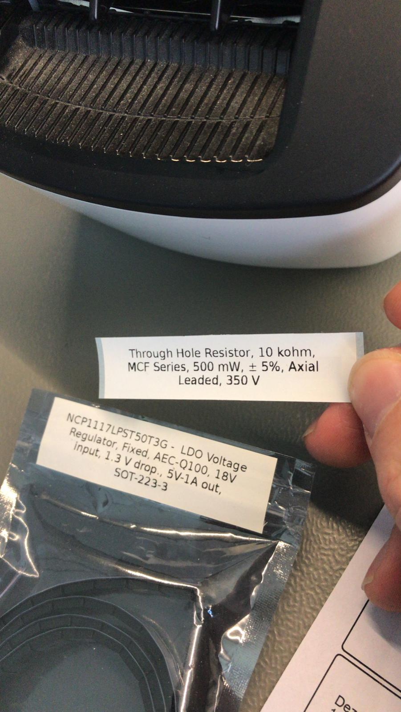
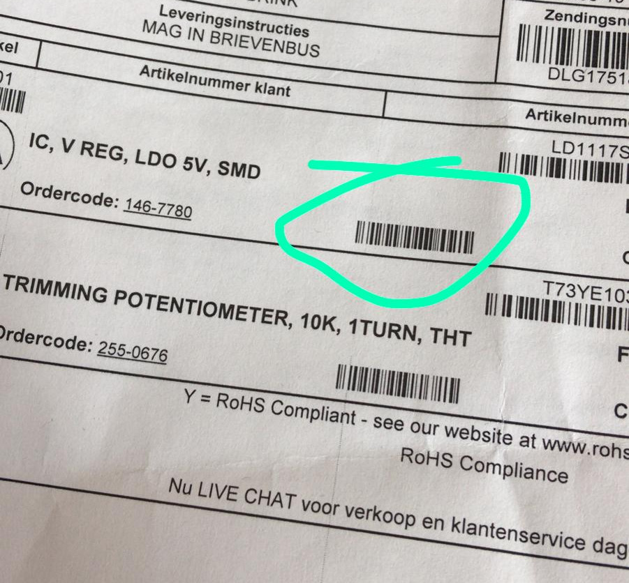

# component-label-printer
A script that get Farnell product codes by tcp as input and throw out product info on a sticker label

Prepare:
sudo apt install glabels python3-lxml

Tested:
Brother-QL-710W, 62mm X 30.48M label

Use:
echo "2627989" | nc localhost 1236   (2627989 is the product code)

